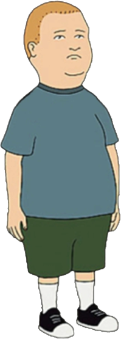

<!-- header -->

  
  <h1>Bobby Hill Meme Generator</h1>
  

    <i>Create memes using custom or predefined images and text.</i>
  

  

    <a href='https://violet-kester.github.io/bobby-hill-meme-generator/' target='_blank'>View Demo</a>
  

<!-- images  -->

  <h3>Image Gallery</h3>
  

  

    
  

